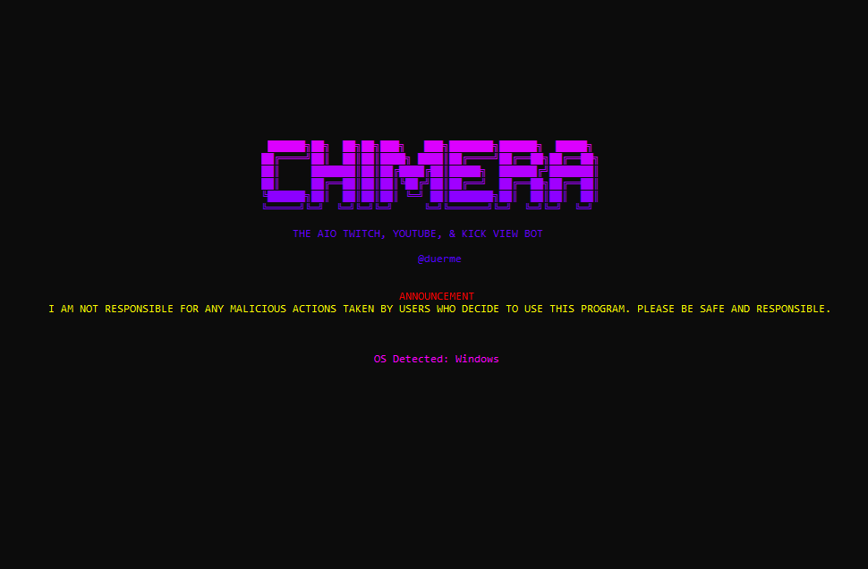
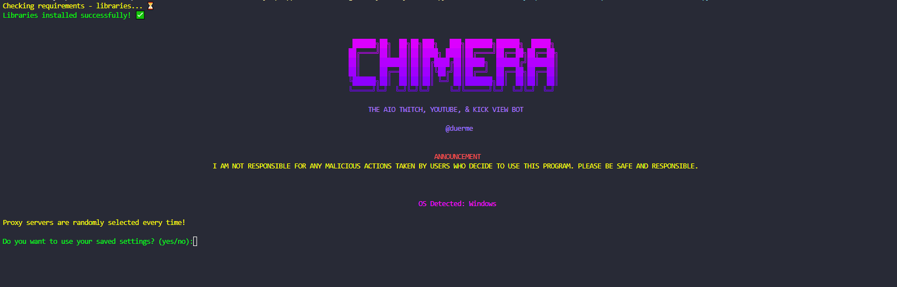

# Chimera

Chimera Bot is a multifunctional viewer bot designed to work with Twitch, YouTube, and Kick platforms. It leverages Selenium WebDriver to automate browser actions and simulate user interactions. The bot can configure stream quality and manage proxy servers for anonymity.



## Overview
Features
- Multi-Platform Support: Works with Twitch, YouTube, and Kick.
- Multi-OS Support: Works with Windows, Linux, and MacOS!
- Proxy Management: Randomly selects proxy servers for each session.
- Quality Setting: Allows setting the stream quality to 160p for low bandwidth/resource usage (***CURRENTLY ONLY WORKING FOR TWITCH***).
- User Settings Management: Saves and loads user settings for convenience.
- Automated Browser Control: Uses Selenium WebDriver for browser automation.

## Requirements
- Python 3.7 or later
- Google Chrome browser installed
- Required Python libraries (listed in requirements.txt)

## Getting Started

### Installation

1. Clone the Repository

```sh
git clone https://github.com/yourusername/chimera.git
cd chimera
```
2. install requirements

***Ensure you have pip installed. Run the following command to install required Python packages:***

```sh
pip install -r requirements.txt
Verify Chrome Installation
```
Ensure Google Chrome is installed on your system. If not, download and install it from here.

## Usage

1. Configuration

- Update settings.txt with your desired settings. If running for the first time, the bot will prompt you to enter these settings.

2. Run the Bot

```sh 
python chimera.py
```

## Step-by-Step Tutorial

### Launch the Application

1. Navigate to the application directory and run the script:

```sh
python chimera.py
```

2. Initial Setup

- On the first run, you will be prompted to enter your streaming platform, channel name or URL, and whether you want to set the stream quality to 160p.

Example:

```sh
Enter the platform (twitch/youtube/kick): twitch
Enter your channel name (e.g., ninja): yourchannelname
Do you want to set the stream quality to 160p (recommended)? (yes/no): yes
```
**Load Saved Settings**

- On subsequent runs, the bot will ask if you want to use the saved settings. You can choose to use them or enter new settings.

**Enter Number of Users**

- Enter the number of users you want to simulate:

```sh
Number of users that you want to send: 10
```

- The bot will open browser windows and simulate viewers for your specified channel.


License
This project is licensed under the MIT License.

# Disclaimer
***I AM NOT RESPONSIBLE FOR ANY MALICIOUS ACTIONS TAKEN BY USERS WHO DECIDE TO USE THIS PROGRAM.***
***PLEASE BE SAFE AND RESPONSIBLE.***
